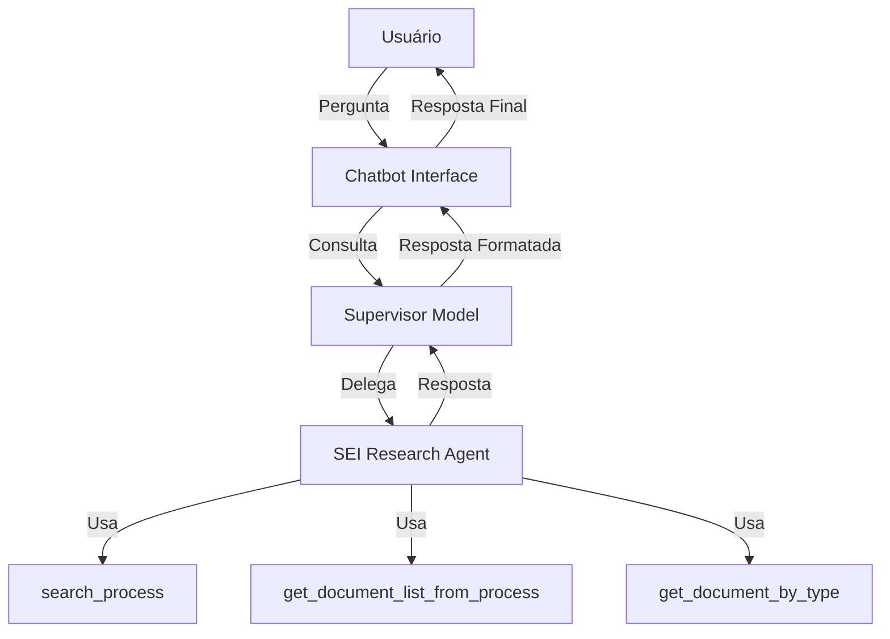

<h1 align="center">SEI Chatbot</h1> 

<div align="center">
  
  
  
</div>

## Visão Geral

O SEI Chatbot é um sistema inteligente para consultar informações de processos administrativos no Sistema Eletrônico de Informações (SEI) do Tribunal Regional Eleitoral do Rio Grande do Norte (TRE-RN). O projeto utiliza uma arquitetura de agentes múltiplos (multi-agent) para processar e responder perguntas dos usuários sobre processos e documentos no sistema SEI.

## Funcionalidades

- **Consulta de Processos**: Permite buscar processos por número de identificação
- **Listar Documentos**: Lista todos os documentos associados a um processo específico
- **Busca por Tipo de Documento**: Filtra documentos de um processo por tipo específico
- **Interface Conversacional**: Interface em Streamlit que permite interação natural com o chatbot

## Tecnologias Utilizadas

- **Backend**: Python, LangGraph, LangChain
- **LLMs**: Groq, Google Gemini, Ollama (configurável)
- **Interface**: Streamlit
- **Monitoramento**: Weights & Biases (Weave)
- **Controle de Versões**: Poetry

## Arquitetura Multi-Agent

O sistema utiliza uma arquitetura de múltiplos agentes para processar e responder às consultas:

1. **Supervisor Model**: Modelo responsável por coordenar o fluxo de trabalho e decidir qual agente especializado deve tratar a consulta do usuário.

2. **SEI Research Agent**: Agente especializado em obter informações sobre processos do SEI, equipado com ferramentas específicas:
   - [`search_process`](tools.py ): Localiza processos pelo número
   - [`get_document_list_from_process`](tools.py ): Lista documentos de um processo
   - [`get_document_by_type`](tools.py ): Filtra documentos por tipo


## Instalação
1. Clone o repositório:
```bash
git clone https://github.com/seu-usuario/sei-chatbot.git
cd sei-chatbot
```

2. Configure as chaves de API no arquivo .env:
```bash
GROQ_API_KEY=sua-chave-groq
GOOGLE_API_KEY=sua-chave-google
WANDB_API_KEY=sua-chave-wandb
```

3. Instale as dependências com o Poetry
```bash
poetry install
```
## Executando a Aplicação


1. Inicie o aplicativo Streamlit:
```bash
poetry run streamlit run Chatbot.py
```

2. Acesse a interface do chatbot em http://localhost:8501


## Configuração de Modelos
Os modelos utilizados pelos agentes podem ser configurados no arquivo Chatbot.py. Atualmente, o sistema suporta:

- Groq: Modelos como llama-3.3-70b-versatile
- Google: Modelos como gemini-2.0-flash-lite
- Ollama: Modelos locais (requer instalação separada do Ollama)

```python
models = {
    "supervisor": {
        "provider": "groq",
        "model": "llama-3.3-70b-versatile",
        "temperature": 0.0
    },
    "agent": {
        "provider": "google",
        "model": "gemini-2.0-flash-lite",
        "temperature": 0.0
    },
}
```

## Estrutura do Projeto

```
sei-chatbot/
├── __pycache__/
├── .env                    # Arquivo de variáveis de ambiente
├── Chatbot.py              # Interface Streamlit
├── MultiAgent.py           # Implementação dos agentes
├── multiagent_chatbot.ipynb  # Notebook para testes
├── processos/              # Diretório com estrutura de processos SEI
│   └── SEI_XXXXX_YYYY/     # Pastas de processos específicos
├── poetry.lock             # Lock file do Poetry
├── pyproject.toml          # Configuração do projeto
├── README.md               # Documentação
└── tools.py                # Ferramentas utilizadas pelos agentes
```

## Como Usar
1. Inicie a aplicação conforme instruções acima
1. Faça perguntas sobre processos SEI como:
   - "O processo 00166/2025 existe?"
   - "Quais documentos existem no processo 00242/2024?"
   - "Quais documentos do tipo Anexo existem no processo 00242/2024?"

## Requisitos do Sistema
- Python 3.12+
- Poetry (gerenciador de pacotes)
- Acesso à internet (para API dos modelos de linguagem)

## Desenvolvimento
Para contribuir com o projeto:

1. Crie um ambiente virtual com Poetry
1. Realize suas alterações
1. Execute testes para garantir compatibilidade
1. Envie um pull request com suas melhorias