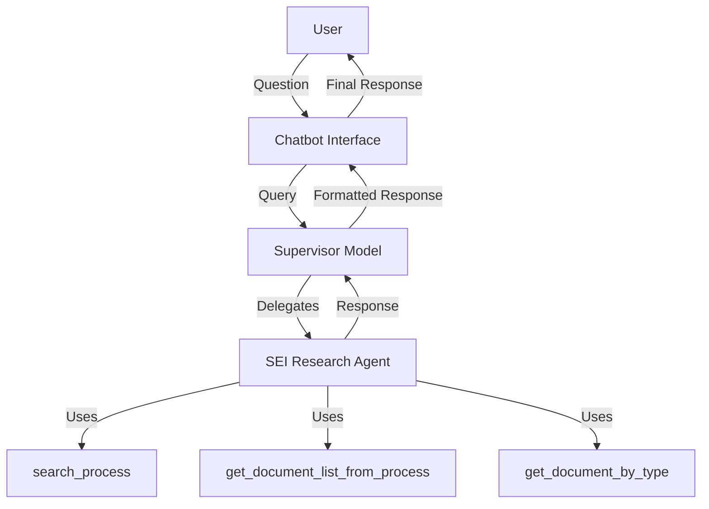

<h1 align="center">SEI Chatbot</h1> 

<div align="center">
    
    
    
</div>

## Overview

SEI Chatbot is an intelligent system for querying information about administrative processes in the Electronic Information System (SEI) of the Regional Electoral Court of Rio Grande do Norte (TRE-RN). The project uses a multi-agent architecture to process and answer user questions about processes and documents in the SEI system.

## Features

- **Process Queries**: Allows searching for processes by identification number
- **Document Listing**: Lists all documents associated with a specific process
- **Document Type Search**: Filters documents in a process by specific type
- **Conversational Interface**: Streamlit interface that allows natural interaction with the chatbot

## Technologies Used

- **Backend**: Python, LangGraph, LangChain
- **LLMs**: Groq, Google Gemini, Ollama (configurable)
- **Interface**: Streamlit
- **Monitoring**: Weights & Biases (Weave)
- **Version Control**: Poetry

## Multi-Agent Architecture

The system uses a multi-agent architecture to process and respond to queries:

1. **Supervisor Model**: Model responsible for coordinating the workflow and deciding which specialized agent should handle the user's query.

2. **SEI Research Agent**: Agent specialized in obtaining information about SEI processes, equipped with specific tools:
     - [`search_process`](tools.py): Locates processes by number
     - [`get_document_list_from_process`](tools.py): Lists documents from a process
     - [`get_document_by_type`](tools.py): Filters documents by type


## Installation
1. Clone the repository:
```bash
git clone https://github.com/your-username/sei-chatbot.git
cd sei-chatbot
```

2. Configure API keys in the .env file:
```bash
GROQ_API_KEY=your-groq-key
GOOGLE_API_KEY=your-google-key
WANDB_API_KEY=your-wandb-key
```

3. Install dependencies with Poetry
```bash
poetry install
```
## Running the Application

1. Start the Streamlit app:
```bash
poetry run streamlit run Chatbot.py
```

2. Access the chatbot interface at http://localhost:8501


## Model Configuration
The models used by agents can be configured in the Chatbot.py file. Currently, the system supports:

- Groq: Models like llama-3.3-70b-versatile
- Google: Models like gemini-2.0-flash-lite
- Ollama: Local models (requires separate Ollama installation)

```python
models = {
        "supervisor": {
                "provider": "groq",
                "model": "llama-3.3-70b-versatile",
                "temperature": 0.0
        },
        "agent": {
                "provider": "google",
                "model": "gemini-2.0-flash-lite",
                "temperature": 0.0
        },
}
```

## Project Structure

```
sei-chatbot/
├── __pycache__/
├── .env                    # Environment variables file
├── Chatbot.py              # Streamlit interface
├── MultiAgent.py           # Agent implementation
├── multiagent_chatbot.ipynb  # Testing notebook
├── processos/              # Directory with SEI process structure
│   └── SEI_XXXXX_YYYY/     # Specific process folders
├── poetry.lock             # Poetry lock file
├── pyproject.toml          # Project configuration
├── README.md               # Documentation
└── tools.py                # Tools used by agents
```

## How to Use
1. Start the application as instructed above
1. Ask questions about SEI processes such as:
    - "O processo 00166/2025 existe?" (Does process 00166/2025 exist?)
    - "Quais documentos existem no processo 00242/2024?" (What documents exist in process 00242/2024?)
    - "Quais documentos do tipo Anexo existem no processo 00242/2024?" (What Annex-type documents exist in process 00242/2024?)

## System Requirements
- Python 3.12+
- Poetry (package manager)
- Internet access (for language model APIs)

## Development
To contribute to the project:

1. Create a virtual environment with Poetry
1. Make your changes
1. Run tests to ensure compatibility
1. Submit a pull request with your improvements
